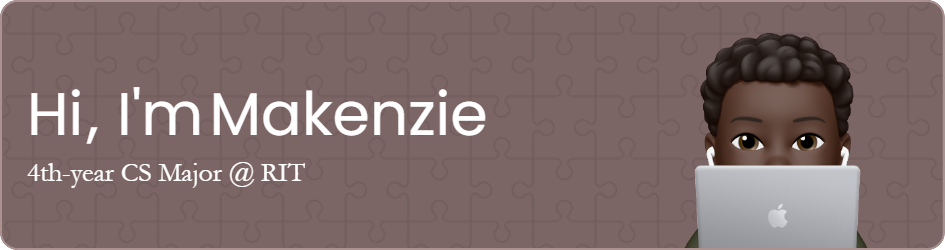

-----

👋 Hey there! I'm Makenzie, a code-crunching aficionado currently experiencing RIT's Computer Science realm. Recently, I have begun an intriguing mission to explore and conquer the vast universe of Quality Assurance. When I am not lost in manual and automated test cases, you'll catch me intensely anticipating the next collective ⚽ team goal, gasping at the missed 🏒 breakaway chance, or mentally collecting stamps in the NPS Passport 📑 I've yet to purchase. Join me as I tinker, travel, ~try not to cry when my teams lose~, and tackle the tech universe, one defect at a time!

  

